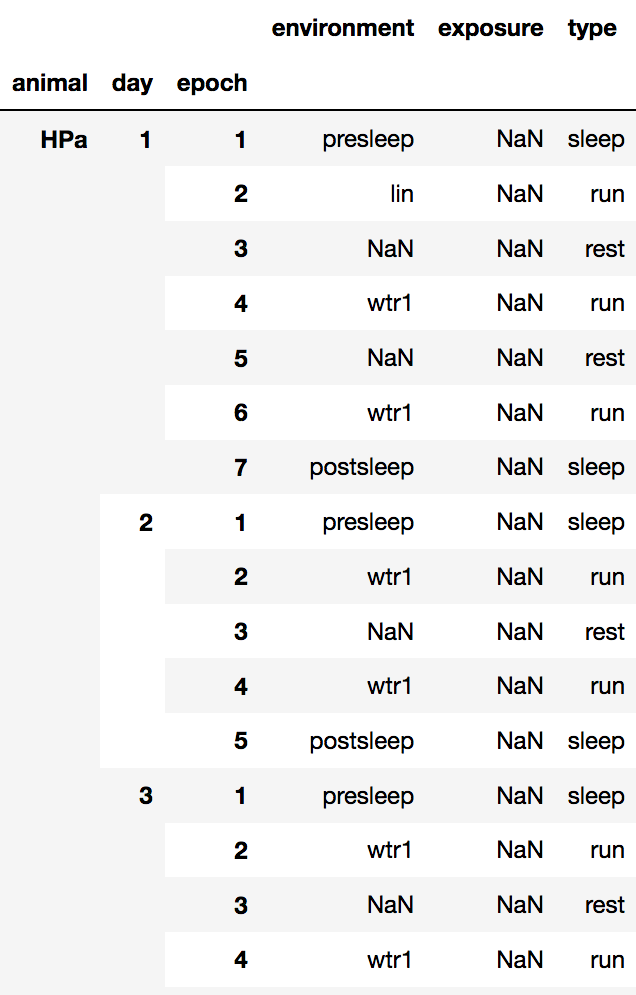
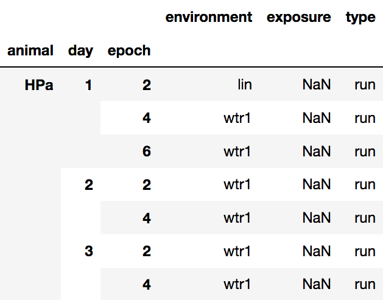

# loren_frank_data_processing
[](https://coveralls.io/github/Eden-Kramer-Lab/loren_frank_data_processing?branch=master)

The `loren_frank_data_processing` package imports Matlab data processed by [Loren Frank's lab](http://www.cin.ucsf.edu/HTML/Loren_Frank.html) into a friendly python format using [pandas](https://pandas.pydata.org/pandas-docs/stable/index.html).

In order to use, the data must follow the format proscribed in this [wiki](https://github.com/Eden-Kramer-Lab/Loren-Frank-Data-Format--Description/wiki).

Features
+ Takes advantages of pandas `DataFrame`, a expressive labeled data format, and associated data manipulation and alignment tools.
+ Time is encoded as pandas `Timedelta`, which avoids funny business with representing time series as floating points.
+ Handy utility for reshaping time series relative to events of interest (`reshape_to_segments`)

### Installation ###
```python
pip install loren_frank_data_processing
```

OR

```python
conda install -c edeno loren_frank_data_processing
```

### Package Dependencies ###
`loren_frank_data_processing` requires:
- python>=3.5
- numpy
- scipy
- pandas
- xarray (only if using features from the saving module)
- netcdf4 (only if using features from the saving module)

See [environment.yml](environment.yml) for the most current list of dependencies.


### Example ###
1. Find all recording epochs:
```pytho
from collections import namedtuple
from os.path import join

from loren_frank_data_processing import make_epochs_dataframe

ROOT_DIR = 'example/path'
RAW_DATA_DIR = join(ROOT_DIR, 'Raw-Data')

Animal = namedtuple('Animal', {'directory', 'short_name'})
ANIMALS = {
    'HPa': Animal(directory=join(RAW_DATA_DIR, 'HPa_direct'),
                  short_name='HPa'),
}

epoch_info = make_epochs_dataframe(ANIMALS)

epoch_info
```


2. We can filter by epoch type:
```python
epoch_info.loc[epoch_info.type == 'run']
```


3. We can use the `epoch_info` index to access the tetrode information for a
recording session.
```python
epoch_info.loc[epoch_info.type == 'run'].index.tolist()
Out:
[('HPa', 1, 2),
 ('HPa', 1, 4),
 ('HPa', 1, 6),
 ('HPa', 2, 2),
 ('HPa', 2, 4),
 ('HPa', 3, 2),
 ('HPa', 3, 4),
 ('HPa', 4, 2),
 ('HPa', 4, 4),
 ('HPa', 5, 2),
 ('HPa', 5, 4),
 ('HPa', 6, 2),
 ('HPa', 6, 4),
 ('HPa', 7, 2),
 ('HPa', 7, 4),
 ('HPa', 8, 2),
 ('HPa', 8, 4)]

 from loren_frank_data_processing import make_tetrode_dataframe

epoch_key = ('HPa', 1, 2)
tetrode_info = make_tetrode_dataframe(ANIMALS)
tetrode_info.xs(epoch_key, drop_level=False)
```


Similarly, the index for the tetrode info can be used as a key to
access LFP information
